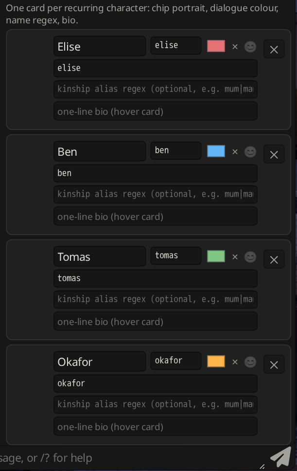
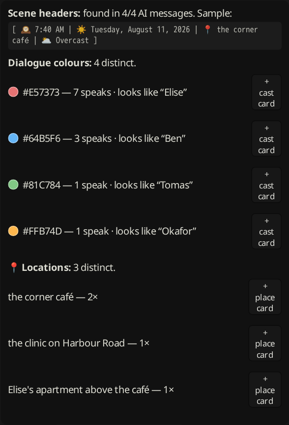
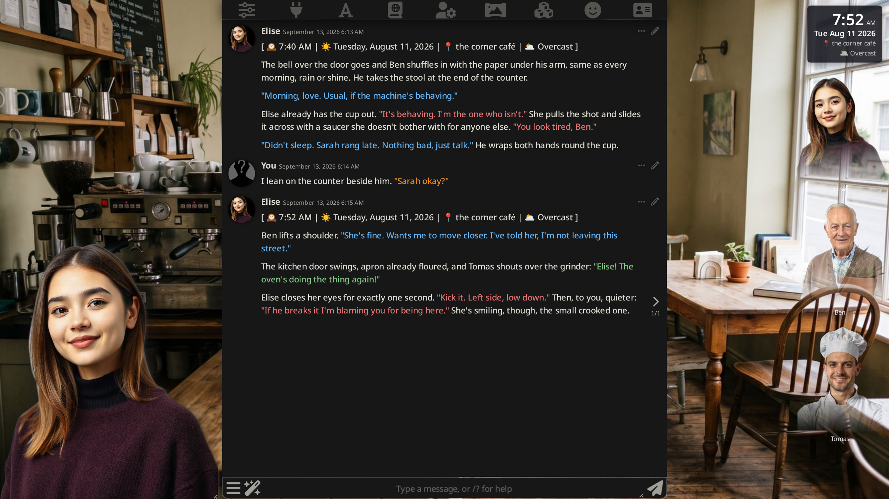

# Scene Director

**Describe your story's world as a deck of cards, and Scene Director runs the stage.**

A [SillyTavern](https://github.com/SillyTavern/SillyTavern) UI extension. You build
two small decks in its settings drawer — **Cast cards** (who can appear: portrait,
dialogue colour, name regex, bio) and **Place cards** (where scenes happen: a matcher
regex plus day/night/dusk/rain/seasonal background slots) — and Scene Director reads
the **scene header** the model already writes at the top of each reply:

```
[ 🕰️ 2:14 PM | ☀️ Tuesday, August 11, 2026 | 📍 the farmhouse kitchen | 🌥️ Overcast ]
```

…then deterministically switches backgrounds, swaps costumes, shows who's on
stage and what the clock says. No AI calls, no chat writes — just the header,
your cards, and the same `/bg` and `/costume` commands you could type yourself.

New chats set up in about a minute: hit **🔍 Scan my chat** and the wizard reads
your existing messages, finds your characters' dialogue colours and your 📍
locations, and offers one-click card creation for each.

## How it compares

Automatic scene management has been a repeatedly requested SillyTavern feature —
see core feature request [SillyTavern#442](https://github.com/SillyTavern/SillyTavern/issues/442)
("configure certain background images to be shown when certain keywords appear").
A few extensions circle the same space from different directions:

| Extension | Approach |
|---|---|
| [Prome VN Extension](https://github.com/Bronya-Rand/Prome-VN-Extension) | Visual-novel *presentation* polish: letterbox, sprite focus/defocus, **manually chosen** world/character tinting |
| [st-weather-cycle](https://github.com/nullara/st-weather-cycle) | **Manually triggered** weather + day/night overlay effects (`/wc weather`, `/wc time`) |
| Scene Transition | **AI-generated** scene changes (asks a model what the scene should look like) |
| **Scene Director** | **Deterministic story-header automation**: the model's own scene header drives backgrounds, costumes, lighting, plus a speaking-cast system driven by dialogue colours |

They're largely complementary — Prome for VN staging, Scene Director for the
automation — and Scene Director detects both at startup: with Prome installed it
steps back from scene tinting (its Weather & Lighting Overlay auto-disables),
and with st-weather-cycle installed its Ken Burns drift auto-disables, so the
two never fight over the same pixels. The settings drawer tells you when a
guard has kicked in.

## Feature list

| Feature | What it does |
|---|---|
| **Auto Backgrounds** *(engine 0.7.0)* | A layered verdict: a matching Place card (+10, decisive) > a generic scene keyword in the 📍 header (+4) > scene nouns in the narration (+1 each, cap +3 — can refine a known place into a sub-scene file, never outranks the header). Hour/weather choose the `-night`/`-rain`/`-dusk` variant when installed; missing files are skipped; below threshold the previous background stays; a change needs a new 📍 or a decisive score. Ships a **starter pack** of 30 generic scenes + night variants (`generic-<key>.jpg`, CC0, generated for this project) with a one-click installer |
| **Seasonal Swaps** | In a given month, swaps a picked background for a variant (Christmas lights in December…) |
| **Era Swaps** | Once the *story* year passes a threshold, swaps one background for another (the half-built house is finished from 2027…) |
| **Auto Costumes** | Switches sprite costumes with `/costume` based on location + time of day (pajamas in the bedroom after 8 pm…) |
| **Cast Strip** *(presence engine 0.6.4)* | Portrait chips for the Cast-card characters **in the scene** — a layered evidence/veto verdict: own dialogue colour (+10, decisive), a physical arrival/position cue in narration near the name (+4), a physical action in the naming sentence (+2), named in the 📍 header (+3); vetoed by a name that only appears inside someone else's speech, an absence/reported-speech sentence (ring, said, would say, remember, about…), a departure, or a location change without fresh evidence. Present at ≥ 4; only decisive evidence earns the 2-message grace. Cue/veto lists editable; `tools/presence-harness.mjs` replays a chat. Previously: — they spoke (dialogue colour) or their name appears next to a presence cue. Silent characters linger dimmed for up to two messages; a departure phrase or a 📍 location change clears them. *(0.5.3)* Only the dialogue colour is strong evidence; a name or kinship alias (cast-card field) needs an arrival/speech cue within ~40 chars and is ignored inside phone/absence sentences ("ring her later"); every add/remove is logged with its evidence |
| **Scene HUD** *(0.2.0, restyled 0.6.3)* | A stacked game-HUD card: the clock is the anchor (28 px, tabular numerals), weekday + date under it, then a receding location line (ellipsised, full text on hover) and weather icon + condition, plus an optional counters row. Presets: *stacked*, *line* (the classic single line), *minimal* (clock only, hover expands), *game* (accent bar coloured by scene state + weather badge); scale and opacity sliders; row toggles; corner picker |
| **Cast Mood Bubbles** *(0.2.0)* | Keyword heuristic per NPC chip: a comic thought bubble (😊/😠/😢) and an optional per-mood portrait variant |
| **Sprite Crossfade** *(0.2.0)* | Fades the previous expression sprite out over the new one on sprite changes |
| **Weather & Lighting Overlay** *(0.2.0)* | Pure-CSS night/dusk/rain tint (plus animated rain streaks) behind the chat, for backgrounds without pre-graded variant files |
| **Sprite Shadow / Lighting Tint** *(0.3.0)* | Grounding drop-shadow + scene-matched darkening on the expression sprite |
| **Background Crossfade** *(0.3.0)* | Dips to black around each `/bg` switch instead of a hard cut |
| **Typing Presence** *(0.3.0)* | Subtle sprite sway + a `…` thought bubble while the model is generating |
| **Ken Burns Drift** *(0.3.0)* | Slow zoom/pan on the background, duration configurable |
| **Fire Flicker** *(0.3.0)* | Warm flicker overlay when the applied background filename matches a pattern |
| **Bio Cards** *(0.3.0)* | Hover a cast chip for its card's one-line bio (or `npc/bios.json`) |
| **Photo Mode** *(0.3.0)* | 📷 button composites background + tint + sprite + HUD into a downloadable PNG |
| **Tab Title** *(0.3.0)* | Browser tab title becomes `<prefix> — <location>, <time>` per message |
| **Emotion Accents** *(0.3.0)* | Transient lighting pulse when the sprite shows anger, fear or love |
| **Idle Presence** *(0.3.0)* | After a quiet period, drifts between the sprite's `neutral-*` variants |
| **Day Trail / Life Counters** *(0.3.0)* | Today's locations + user-defined story-date counters in the HUD tooltip |
| **Speaking Order** *(0.3.0)* | Cast chips ordered latest-speaker-first |
| **Asset Preloading** *(0.3.0)* | Idle-callback prefetch of card backgrounds and neutral sprite variants (skipped on data-saver / 2G connections) |
| **Card system + Scan wizard** *(0.4.0)* | Cast & Place cards replace the raw JSON maps; the Scan-my-chat wizard builds them from your existing chat |
| **Inline Mood Tag** *(0.4.1, zero-setup + default ON in 0.5.0)* | The model appends `[MOOD: <label>]` to each reply and the expression sprite follows it directly (`/emote`) — no classifier API call; the tag is hidden from the rendered chat. The instruction auto-injects into the context — nothing to paste |
| **Stage layout** *(0.5.0)* | HUD corner picker; cast strip corner (top corners stack a column under the HUD), chip style (cutout bottom-fade / cloud glow / circle / plain) and chip size relative to the window (auto = 28vh, or a 10–40vh slider). *(0.5.2)* Top-corner columns are a fixed box filling the gutter beside the chat panel, so chips can never overlap the chat; a gutter under 110px collapses them to 48px circles |
| **Unknown Speakers** *(0.5.4)* | A dialogue colour that matches no Cast card still gets a chip: a soft silhouette (inline SVG, tinted with that colour; male/female/neutral from nearby pronouns) labelled with the best name guess from the text before its first line. Set your own dialogue colour in the drawer so the main character is never an "unknown" |
| **Character size** *(0.6.2)* | One fixed rendered height for the expression sprite, so low-res animated webps and high-res static PNGs are identical on screen (ST's own rule is intrinsic-size driven). Default matches ST's static size `min(90vh, gutter ÷ aspect)`; slider 30–100 vh plus X/Y offsets; clamped so she never covers the chat |
| **Mood Engine** *(0.6.0)* | Layered verdict — tag → ST's local go_emotions classifier → weighted lexicon with vetoes — on the character's own dialogue + narration; deterministic rules, 8 s hysteresis, NPC variants from the same pipeline. See *How moods are decided* |
| **Thought Tooltips** *(0.5.3)* | Hover the sprite or a cast chip for a dark card with the bio line, mood emoji and the last 1–2 sentences the model wrote about that character's inner state (regex over the last reply + reasoning, configurable verbs; cached per message; no AI calls) |
| **Thought bubbles** *(0.5.2)* | Typing dots above the sprite while generating, then the mood emoji (configurable label → emoji map) for a few seconds; NPC chips get the same (happy/angry/sad) |
| **Chat panel glass** *(0.5.0)* | Optional see-through chat panel: opacity slider + blur toggle, honouring the theme's own tint when it is already more transparent (off by default) |
| **Costume path fix** *(0.5.0)* | Bare costume names are issued as `<ActiveCharacter>/<name>` — SillyTavern resolves a bare `/costume` argument as a *top-level* sprite folder, so `/costume pajamas` silently 404'd every sprite |
| **Chat-portable state** *(0.5.0)* | Day trail, last costume and cast presence live in ST **chat metadata**, so they travel with the chat file across devices and branches; on chat open the state rebuilds deterministically from the last ~20 messages when missing — pure text parsing, no AI calls |

Every feature is independently toggleable. With no scene header in a message,
everything no-ops quietly. The extension only reads messages and issues slash
commands — it never modifies your chat.

> **Screenshot placeholders**
>
> 
> 
> 

## The scene header

Scene Director expects each AI message to begin with (or contain) a header like
the example above. The default parsing regexes match exactly that format
("Freaky Frankenstein"-style time trackers), but all of them are editable, so
any header that carries a location, a clock time, and a date can drive the
extension.

**This extension does not generate scene headers.** Your preset / system prompt
must instruct the model to emit one per reply. The settings drawer has a
one-click-copy snippet for presets that don't emit headers yet:

> Begin every reply with a status line in this exact format:
> `[ 🕰️ <12h time> | ☀️ <Weekday, Month D, YYYY> | 📍 <current location> | 🌥️ <weather> ]`

## Installation

1. In SillyTavern, open **Extensions** (the stacked-blocks icon) → **Install extension**.
2. Paste this repository's URL:
   ```
   https://github.com/ryzendigo/scene-director
   ```
3. Click **Install for all users** (or just yourself), then find **Scene Director**
   in the Extensions settings panel.

Manual install: clone this repo into
`data/<user>/extensions/scene-director/` and reload the page.

## The 60-second setup

1. Open **Extensions → Scene Director** in a chat that already has some messages.
2. Click **🔍 Scan my chat**. The wizard reports:
   - whether scene headers were detected (with a sample line),
   - every distinct dialogue `<font color>` hex, its speak count, and a guess
     at whose colour it is,
   - every distinct 📍 location and how often it appeared.
3. Click **+ cast card** / **+ place card** on the rows you want. Guesses are
   pre-filled; fix a name here, pick a background there.
4. For each Place card, choose a background for the ☀️ day slot (the dropdowns
   list your installed backgrounds). Night/dusk/rain/seasonal slots are optional.
5. Turn on the features you want. Done.

**Test last message** dry-runs the whole parser against the current chat's last
AI message and shows exactly what was detected — use it constantly while tuning.

## Cards

### Cast cards

One card per recurring character:

- **Portrait**: the chip image. By default `/characters/<Cast sprite folder>/npc/<key>.png`
  (create an `npc/` folder inside one character's sprite folder and drop in one
  square PNG per member, named after its key). Cards added via **Add from my
  characters** use that character's avatar thumbnail automatically.
  Transparent-cutout portraits look best — the chip draws a subtle
  radial-gradient backing behind the image, so heads sit inside the circle
  instead of floating on the source photo's background. Batch-convert a folder
  of portraits with [`tools/cutout.py`](tools/README.md) (rembg-based, one
  command).
- **Colour swatch**: the character's pinned dialogue colour. Its hex appearing
  in the raw message means they *spoke* — the most precise presence signal.
- **Name regex**: fallback detection for characters without a colour (matches
  mentions too, not just speech).
- **😊 badge**: mark a member that has `<key>-happy/-angry/-sad.png` mood
  portrait variants on disk (informational — missing files always fall back).
- **Bio line**: shown on chip hover when Bio Cards is enabled
  (`npc/bios.json` still works as a fallback source).

### Place cards

One card per location. **First matching card wins**, so order specific places
above generic ones ("Carter farmhouse kitchen" above "kitchen").

- **Matcher regex**: case-insensitive, tested against the 📍 location text only.
- **Background slots**: ☀️ day (the default), plus optional 🌙 night
  (19:00–05:59), 🌆 dusk (17:00–18:59), 🌧 rain (weather text matches the rain
  regex) and 🎄 seasonal (used in the month you set, default December). Empty
  slots fall back to day. Each slot is a dropdown of your installed backgrounds
  (fetched from SillyTavern itself).
- When a night/dusk/rain slot was used, the Weather & Lighting Overlay stands
  down for that scene — your pre-graded file already carries the mood, so
  nothing double-darkens.

Old 0.3.x `backgroundMap` configs migrate into Place cards automatically (day
slot filled, name derived from the pattern). The old JSON shape still imports.

### Power users: JSON in, JSON out

Everything the cards describe — plus seasonal/era/costume/mood/counter rules —
lives in one JSON blob. **Import / export** at the bottom of the drawer dumps
and restores the whole configuration, so you can hand-edit, version-control,
or move a setup between installs.

## Configuration reference

### Header regexes

| Field | Convention |
|---|---|
| Location regex | capture group 1 = the location text |
| Time regex | group 1 = hour, group 2 = minutes, optional group 3 = `AM`/`PM`. If your header uses a 24-hour clock, write a regex with no group 3. |
| Date regex | group 1 = month (English name **or** number 1–12), group 2 = day, group 3 = 4-digit year |
| Weather regex | group 1 = the weather text. Matched against the **header line** (the line the location regex hit); the default grabs the last `\|`-separated segment before the closing `]` |
| Rain regex | matched against the lowercased weather text; a hit means "it's raining" (default `rain\|storm\|shower\|drizzl`) |

### Seasonal map / era rules (Advanced JSON)

Applied *after* a Place card picks a file:

```json
[ { "month": 12, "from": "living-room.jpg", "to": "living-room-christmas.jpg" } ]
```

```json
[ { "minYear": 2027, "pattern": "build site|the rise", "from": "house-frame.jpg", "to": "house-finished.jpg" } ]
```

(For a single place, the card's 🎄 seasonal slot covers the common case; the JSON
rules remain for cross-cutting swaps.)

### Costume rules (Advanced JSON)

First matching rule wins. Hours are 0–23 and the window may wrap midnight
(`fromHour: 20, toHour: 7` = 8 pm–7 am). `fromHour == toHour` means all day.
An empty `costume` — or no rule matching — selects the character's **default**
costume. Costumes only change when the header contained a parseable time, and
Scene Director never re-issues `/costume` for an unchanged value.

Since 0.5.0 a bare costume name is issued as `<ActiveCharacter>/<name>`
(SillyTavern resolves a bare argument as a **top-level** sprite folder, so
`/costume pajamas` used to 404 every sprite and the character went invisible).
A value already containing `/` is passed through verbatim. A **Hold costume**
toggle in the drawer (or `window.sceneDirectorHoldCostume = true` from the
console) freezes auto-costuming at whatever `/costume` last set.

```json
[ { "pattern": "bedroom|their room", "fromHour": 20, "toHour": 7, "costume": "pajamas" } ]
```

> Tip from the prototype this was extracted from: keep auto-costuming
> conservative. Anything sensitive or situational is better left to a manual
> `/costume` — only automate the swaps that are always correct.

### Cast Mood Bubbles

For each present NPC, Scene Director collects the text of their
`<font color="#hex">` dialogue spans **plus** a ±120-character narration window
around each (name-regex matches for members without a colour), then scores three
keyword sets over it. Highest score wins; zero hits = neutral (no bubble). The
keyword sets are editable (Advanced JSON):

```json
{
  "happy": "laugh|chuckl|smil|grin|warm|bright|beam",
  "angry": "snap|sharp|cold|flat|hard|stern|glare|slam|hiss",
  "sad": "tear|wept|weep|cries|crying|sob|quiet(?:ly)?\\s+sad|trembl|waver"
}
```

It's a heuristic — tune the word lists to your story's prose. It will sometimes
be wrong; that's what makes the bubbles charming rather than authoritative.

### Inline Mood Tag (0.4.1 — zero-setup and ON by default since 0.5.0)

Normally the expressions extension classifies each reply (locally or via an
API call) to pick the sprite. With **Inline Mood Tag** on, the model reports
its own mood instead: it appends a trailing tag like `[MOOD: joy]` and Scene
Director runs `/emote joy` immediately — zero classifier round-trips for
tagged messages.

**Since 0.5.0 this needs no setup**: the instruction below is injected
automatically via ST's extension-prompt mechanism — since 0.5.5 as a **system
message at depth 0, i.e. placed absolutely last, after your message** (for
chat completion this is `populationInjectionPrompts()` splicing depth-0
injections at the end), with mandatory-format wording so presets that end
replies with a planning/`<details>` block still emit the tag — so there is
nothing to paste into your preset. The toggle turns injection and tag parsing on/off
together. The snippet remains in the drawer for reference:

> At the very end of every reply, on its own line, append [MOOD: \<one word\>]
> choosing the single best fit from: admiration, amusement, anger, annoyance,
> approval, caring, confusion, curiosity, desire, disappointment, disapproval,
> disgust, embarrassment, excitement, fear, gratitude, grief, joy, love,
> nervousness, optimism, pride, realization, relief, remorse, sadness,
> surprise, neutral.

Details:

- The tag is **hidden from the rendered message** but kept in the chat data,
  so the model keeps seeing (and emitting) its own tags consistently.
- Fullwidth brackets (`〔MOOD: joy〕`) are accepted too.
- A missing tag, or an unknown label, does nothing — your configured
  expression classifier keeps working as the fallback.
- With the tag reliably driving the sprite you can turn the expression
  classifier off yourself (Extensions → Character Expressions → set the
  classifier API to **None**) and skip its per-message call entirely. Scene
  Director never changes another extension's settings for you. *(0.5.1)*
  With the classifier set to None, ST itself clears the sprite on chat load,
  inside `/costume`, and on its worker tick after each message — Scene
  Director now asserts every `/emote`, verifies the sprite is drawn, and
  replays the last tagged mood after chat loads and costume switches, so
  the sprite never goes blank. (Setting a fallback expression in the
  expressions extension helps too.)
- **Test last message** shows the detected tag in its dry-run output.

### How moods are decided (0.6.0)

The sprite no longer depends on the model remembering a tag. Every finished
AI message goes through a layered verdict (all local, no external calls):

- **L0 — the character's own material.** Her dialogue spans (your *Own
  dialogue colour*, auto-detected if blank) plus narration sentences about her
  (name/alias, or she/her right after her own line — or by default when none of
  the *Other female names* appear). `<details>` blocks, reasoning and the scene
  header are dropped; the last 40 % of the message weighs double.
- **L1 — tag.** `[MOOD: x]`, a `Mood: x` line inside `<details>`, or the
  reasoning text.
- **L2 — local classifier.** SillyTavern's built-in server-side go_emotions
  model (`/api/extra/classify`) on the L0 text. Scores are read as *shares* of
  the top-5 (it is a multi-label model; a clear sentence tops out ~0.15 raw).
- **L3 — lexicon.** ~110 weighted cues (laughs → amusement, cheeks go pink →
  embarrassment, jaw sets → anger, shoulders drop → relief…) with vetoes
  (laughter ⇒ not sadness/grief/anger/fear; tears ⇒ not joy/amusement/pride)
  and a negation window ("not angry"). Editable in Advanced JSON.

Rules, in order: **1** tag if present; **2** a tag contradicted by ≥ 2 lexicon
hits is replaced by the lexicon's top label; **3** no tag → (a) strong lexicon
evidence (top cue weight ≥ 4) beats a merely adequate classifier, (b) classifier
top if share ≥ 0.35 (0.45 for neutral/confusion) and not vetoed, (c) lexicon top
with ≥ 2 weighted hits, (d) best non-vetoed of the classifier's top-3 if ≥ 0.25,
(e) otherwise **hold** the previous mood; **4** neutral is never chosen for lack
of evidence; **5** a new mood dwells ≥ 8 s and the same label is never
re-emitted; **6** labels missing from the active costume folder map to the
nearest available (amusement → joy, annoyance → anger, grief → sadness…).
NPC chips run the same pipeline per cast member, mapped to their
happy/angry/sad variants. The drawer shows the last verdict and which rule
decided it; with *Debug Logging* on, each verdict is logged in full.

`tools/mood-harness.mjs` runs the pure engine over a saved chat `.jsonl` so you
can check verdicts against what you read.

### Starter backgrounds (0.7.0)

`backgrounds/` in this repo holds 30 generic scenes plus a `-night` variant of
each — restaurant, cafe, pub, kitchen, dining, living, bedroom, bathroom,
office, hallway, porch, backyard, street, city-street, park, beach, forest,
country-road, farm, church, hospital, clinic, school, shop, hotel, car,
transit, library, gym, rooftop — as `generic-<key>.jpg` / `generic-<key>-night.jpg`
(~1600 px, ~250 KB each, CC0 / free to use, generated for this project).

**Install:** Extensions → Scene Director → *Install starter backgrounds*. It
uploads each file through SillyTavern's own Backgrounds endpoint and skips
ones you already have. **Manual copy:** drop the files into your user's
`backgrounds/` folder (`data/<user>/backgrounds/`) and reload.

With **Generic Fallback** on (default), a 📍 header that matches no Place card
is classified by keyword into one of these scenes; the narration's scene nouns
(booth, pew, steering wheel…) can decide when the header offers nothing. Both
keyword tables are editable under Advanced JSON.

### Life counters (Advanced JSON)

Computed from the parsed **story** date (never real time), shown in the HUD
tooltip, hidden until their anchor date is reached:

```json
[
  { "label": "married",  "emoji": "💍", "date": "2026-07-11", "mode": "days"  },
  { "label": "pregnant", "emoji": "🤰", "date": "2026-06-28", "mode": "weeks" }
]
```

`mode: "days"` renders `💍 31 days`; `mode: "weeks"` renders `🤰 6w2d`.

### The presence pack (0.3.0)

Sprite shadow/tint, background crossfade, typing presence, Ken Burns, fire
flicker, bio cards, photo mode, tab title, emotion accents, idle presence, day
trail, speaking order, preloading — all independent toggles, all off by default
except Sprite Shadow. See the tooltips on each toggle; behaviour is unchanged
from 0.3.0 apart from the performance work below.

## Performance notes (0.4.0)

- The message text is extracted and header-parsed **once per event**, capped at
  the first 20,000 characters, and shared by every feature.
- All regexes are compiled once (module-level or cached); nothing rebuilds a
  `RegExp` per message.
- The cast strip **diffs** its chips (add/remove/update by key) instead of
  rebuilding; all per-event DOM writes are batched into a single
  `requestAnimationFrame`.
- Every animation runs on `transform`/`opacity` only; the lighting tint colour
  is *set* once per scene-state change and only its opacity transitions.
- The sprite MutationObserver watches `#expression-holder` only, and is
  disconnected/re-attached on chat switch; all timers are cleared on chat
  switch and page hide.
- Prefetching runs in `requestIdleCallback`, once per session, and is skipped
  entirely on data-saver / 2G connections.
- A disabled feature costs zero: no listeners, no DOM, no timers.

## FAQ

**My chat has no scene headers — nothing happens.**
Correct: this extension is a *consumer* of scene headers, not a producer. It needs
a preset/system prompt that makes the model emit them (copy the snippet from the
settings drawer). Use **Test last message** to check whether your regexes find anything.

**Backgrounds don't change even though the location parses.**
The location must match a Place card, and the slot's file must exist in your
backgrounds list (try `/bg` by hand). Also note the dedupe: if the picked
background is already the last one Scene Director set, it won't re-issue.

**Costumes never change.**
Auto Costumes needs (a) the toggle on, (b) a parseable time in the header, and
(c) a matching rule. `/costume` also requires the character to have a sprite pack
with costume subfolders.

**Does it work with swipes?**
Yes — swiping re-runs the whole pipeline on the new message. Switching chats resets
the dedupe state and immediately applies rules to the opened chat's last message.

**Why did my Weather Overlay / Ken Burns toggle stop doing anything?**
Check the note at the top of the drawer — a compat guard has probably detected
Prome VN Extension or st-weather-cycle and stood that feature down.

**Can it break my chat?**
No. It only reads messages and runs `/bg`/`/costume`. Every feature is wrapped in
its own try/catch, so one misbehaving card can't take the others down.

## License

MIT — see [LICENSE](LICENSE).
